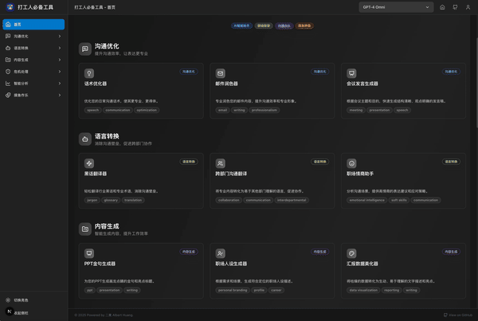
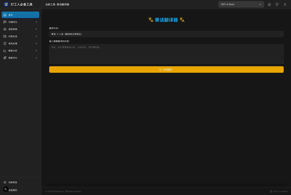

# Workplace Toolkit - Officer Working Toolbox


<div align="center">

[](https://github.com/AlbertHuangKSFO/workplace-optimizer/stargazers)
[](https://github.com/AlbertHuangKSFO/workplace-optimizer/network)
[](https://github.com/AlbertHuangKSFO/workplace-optimizer/issues)
[](https://github.com/AlbertHuangKSFO/workplace-optimizer/blob/main/LICENSE)

**🚀 AI-Powered Workplace Tools Collection for Enhanced Efficiency, Smoother Communication, and Artistic Procrastination**

[Live Demo](https://workplace-optimizer.vercel.app) | [Features](#features) | [Quick Start](#quick-start) | [Contributing](#contributing)

</div>

> **Language**: [中文](README.md) | English

## 📖 Project Overview

Workplace Optimizer is a comprehensive AI-powered workplace tools platform designed to help professionals enhance work efficiency, optimize communication skills, and tackle workplace challenges. Whether you're a newcomer to the workplace or an experienced professional, there are tools here suitable for you.





### 🎯 Core Philosophy

- **Efficiency First**: Using AI technology to solve repetitive workplace tasks
- **Communication Optimization**: Enhancing the professionalism and effectiveness of workplace communication
- **Crisis Response**: Providing solutions and script templates for workplace difficulties
- **Learning Through Fun**: Improving work efficiency while maintaining the joy of work

## 🌟 Features

We categorize all tools into the following major categories for your convenience:

| Category                       | Tool Name                             | Status  | Description                                                                                      |
| :----------------------------- | :------------------------------------ | :------ | :----------------------------------------------------------------------------------------------- |
| **✍️ Communication & Writing** |                                       |         | Enhance the quality of written and verbal communication                                          |
|                                | Email Polisher                        | ✅ Live | Professionally optimize your email content                                                       |
|                                | Jargon Translator                     | ✅ Live | Easily understand and use industry jargon                                                        |
|                                | Cross-Department Translator           | ✅ Live | Break down communication barriers between departments                                            |
|                                | EQ Assistant                          | ✅ Live | Improve your workplace emotional intelligence dialogue skills                                    |
|                                | Meeting Speech Generator              | ✅ Live | Help you prepare organized meeting speeches                                                      |
|                                | Speech Optimizer                      | ✅ Live | Optimize your expressions to make them more powerful                                             |
|                                | PPT Golden Phrases Generator          | ✅ Live | Add finishing touches to your PPT                                                                |
|                                | Resignation/Job Change Copy Generator | ✅ Live | Write resignation or job change content professionally                                           |
|                                | Meeting Nonsense Translator           | ✅ Live | Identify and translate redundant expressions in meetings                                         |
| **🧠 Intelligent Analysis**    |                                       |         | Use AI for analysis, insights, and decision support                                              |
|                                | Report Data Beautifier                | ✅ Live | Make your data and reports more beautiful and professional                                       |
|                                | Team Mood Detector                    | ✅ Live | Gain insights into your team's current emotions and atmosphere                                   |
|                                | Meeting Notes Organizer               | ✅ Live | Intelligently organize your meeting records                                                      |
|                                | Colleague Persona Analyzer            | ✅ Live | Analyze colleagues' possible behavior patterns and communication styles                          |
|                                | Weather-Mood Correlation              | ✅ Live | AI combines real-time weather to analyze its subtle impact on work mood (based on Meizu Weather) |
|                                | Career Path Forecaster                | ✅ Live | AI analyzes potential career development paths, opportunities, and challenges                    |
| **🛡️ Workplace Survival**      |                                       |         | Handle workplace challenges, manage interpersonal relationships, resolve crises                  |
|                                | Anti-PUA Assistant                    | ✅ Live | Help you identify and deal with workplace PUA                                                    |
|                                | Blame Game Tactics                    | ✅ Live | Provide communication tactics for different scenarios                                            |
|                                | Crisis PR Templates                   | ✅ Live | Quickly generate professional crisis PR statements                                               |
|                                | Boss Radar                            | ✅ Live | Simulate monitoring office danger levels to help you procrastinate safely                        |
|                                | Side Hustle Assessor                  | ✅ Live | AI evaluates your side hustle potential and discovers hidden money-making opportunities          |
|                                | Career Leveling System                | ✅ Live | Simulate the workplace advancement path from newbie to CEO, experience the fun of leveling up    |
| **💡 Content Creation**        |                                       |         | Generate various workplace-related content and materials                                         |
|                                | Nickname Generator                    | ✅ Live | AI comes up with brilliant names for your projects, teams, pets, or anything                     |
|                                | Professional Persona Generator        | ✅ Live | Quickly create professional workplace personas                                                   |
|                                | Weekly Report Enhancer                | ✅ Live | Make your weekly reports more prominent and eye-catching                                         |
|                                | PPT Common Golden Phrases             | ✅ Live | Provide resonant golden phrases and powerful short sentences for your PPT and speeches           |
|                                | Data Magician                         | ✅ Live | Transform mundane data into compelling presentations                                             |
|                                | Worker Meme Generator                 | ✅ Live | More customized worker-exclusive meme packages                                                   |
| **🎉 Office Fun**              |                                       |         | Provide relaxing and entertaining office tools                                                   |
|                                | Meeting Doodle Buddy                  | ✅ Live | The best companion for procrastinating during meetings                                           |
|                                | Office Feng Shui Detector             | ✅ Live | See how your workstation's feng shui is                                                          |
|                                | Office Outfit Advisor                 | ✅ Live | Provide outfit suggestions based on occasions and styles                                         |
|                                | Sanity Check Meter                    | ✅ Live | Test your mental state before leaving work                                                       |
|                                | Universal Excuse Generator            | ✅ Live | Need excuses for leave/being late/leaving early?                                                 |
|                                | Awesome Compliment Generator          | ✅ Live | Generate various complimentary words and phrases                                                 |
|                                | Daily Fortune (Nonsense Version)      | ✅ Live | Daily fortune, purely for entertainment                                                          |
|                                | Daily Worker Motivational Quotes      | ✅ Live | Daily "positive energy" quotes                                                                   |
|                                | Daily Slacking Almanac                | ✅ Live | Worker-exclusive almanac                                                                         |
|                                | Impressive Meeting Phrases            | ✅ Live | Generate professional-sounding meeting terminology                                               |
|                                | Introduction to Slacking              | ✅ Live | Systematically learn the theory and practice of slacking                                         |
|                                | Lunch Decision Overlord               | ✅ Live | End your lunch choice paralysis                                                                  |
|                                | Meeting Bingo Generator               | ✅ Live | Meetings are no longer boring, let's play Bingo                                                  |
|                                | Workplace Meme Generator              | ✅ Live | Quickly generate interesting workplace meme images and text                                      |
|                                | Random Chicken Soup/Poison Soup       | ✅ Live | One-click switch between today's chicken soup or poison soup                                     |
|                                | Parallel Universe Work Simulator      | ✅ Live | Explore work experiences in different parallel universes                                         |
|                                | Electronic Wooden Fish                | ✅ Live | Tap it to eliminate work worries                                                                 |
|                                | Office Ghost Stories                  | ✅ Live | Office worker-exclusive horror stories to refresh and energize                                   |
|                                | Work Time Machine                     | ✅ Live | Experience work methods from 30 years ago/future                                                 |
| **⏳ Time Efficiency**         |                                       |         | Manage time, improve efficiency, plan personal goals                                             |
|                                | Pro Slacking Clock                    | ✅ Live | Professional procrastination time manager                                                        |
|                                | Workday Countdown                     | ✅ Live | See how long until leaving work/weekend/vacation                                                 |
|                                | Slacking Index Calculator             | ✅ Live | Quantify your procrastination level                                                              |
|                                | Salary Ticker                         | ✅ Live | Real-time display of "how much you earned this minute"                                           |
|                                | Fire Countdown                        | ✅ Live | Calculate when to achieve financial freedom at current savings rate                              |
|                                | Procrastination Buster                | ✅ Live | Break down big tasks into 5-minute small tasks                                                   |
| **🧘 Health & Wellness**       |                                       |         | Focus on the physical and mental health of workplace professionals                               |
|                                | Office Yoga Guide                     | ✅ Live | Stretching and relaxation exercises suitable for workstations                                    |
|                                | Stealth Spending Log                  | ✅ Live | Calculate annual total expenses for small purchases like bubble tea and takeout                  |
|                                | Caffeine Dependency Index             | ✅ Live | Calculate your daily caffeine intake                                                             |

## 🚀 Quick Start

### Requirements

- Node.js 18+
- npm or yarn
- Git

### Installation - 🐳 Docker Deployment (Recommended)

1. **Clone the repository**

```bash
git clone https://github.com/AlbertHuangKSFO/workplace-optimizer.git
cd workplace-optimizer
```

2. **Configure environment variables**

```bash
# Copy environment variable template
cp .env.example .env

# Edit environment variables, add your AI API keys
nano .env
```

3. **Start Docker**

```bash
# Method 1: Use startup script
./docker-dev.sh

# Method 2: Use docker-compose directly
docker-compose up -d
```

4. **Production deployment**

```bash
# Build production image
make prod-build

# Start production environment
make prod
```

#### Service Addresses

- **Frontend**: http://localhost:3000
- **Backend**: http://localhost:8000
- **Redis**: localhost:6379

## 🆙 Upcoming Features

- English support
- Other features
  - Worker meme generator
  - Workday countdown
  - Slacking index calculator
  - Daily do's and don'ts: work version almanac (should slack, avoid overtime, etc.)
  - Salary reverse calculator: display "how much money earned per minute"
  - Random chicken soup/poison soup switcher
  - Rainbow fart generator
  - Boss radar: simulate monitoring office danger levels to help you slack safely
  - Caffeine dependency index: calculate daily coffee/tea consumption
  - Work time machine experience: experience work methods from 30 years ago/future

## 🤝 Contributing

We welcome all forms of contributions! Whether it's new features, bug fixes, documentation improvements, or design optimizations.

### How to Contribute

1. **Fork the project**
2. **Create a feature branch** (`git checkout -b feature/AmazingFeature`)
3. **Commit your changes** (`git commit -m 'Add some AmazingFeature'`)
4. **Push to the branch** (`git push origin feature/AmazingFeature`)
5. **Create a Pull Request**

### Development Standards

- Follow existing code style
- Add appropriate tests for new features
- Update relevant documentation
- Ensure all tests pass

### Issue Reporting

If you find bugs or have new feature suggestions, please:

1. Check [Issues](https://github.com/AlbertHuangKSFO/workplace-optimizer/issues) to confirm the issue hasn't been reported
2. Create a new Issue with detailed description of the problem or suggestion
3. Use appropriate labels for categorization

## 📄 License

This project is licensed under the MIT License - see the [LICENSE](LICENSE) file for details.

## 🙏 Acknowledgments

- Thanks to all contributors for their efforts
- Thanks to the open source community for providing excellent tools and libraries
- Special thanks to all users who provided feedback and suggestions

## 📞 Contact Us

- **Project Homepage**: [GitHub Repository](https://github.com/AlbertHuangKSFO/workplace-optimizer)
- **Live Demo**: [Live Demo](https://workplace-optimizer.vercel.app)
- **Issue Reporting**: [GitHub Issues](https://github.com/AlbertHuangKSFO/workplace-optimizer/issues)

---

<div align="center">

**⭐ If this project helps you, please give us a star!**

Made with ❤️ by [Albert Huang](https://github.com/AlbertHuangKSFO)

</div>
