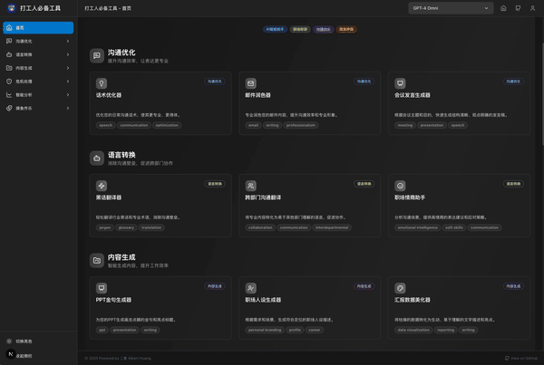

# 打工人必备工具 - 职场优化器


<div align="center">

[](https://github.com/AlbertHuangKSFO/workplace-optimizer/stargazers)
[](https://github.com/AlbertHuangKSFO/workplace-optimizer/network)
[](https://github.com/AlbertHuangKSFO/workplace-optimizer/issues)
[](https://github.com/AlbertHuangKSFO/workplace-optimizer/blob/main/LICENSE)

**🚀 AI 驱动的职场工具集合，让工作更高效、沟通更顺畅、摸鱼更有艺术感**

[在线体验](https://workplace-optimizer.vercel.app) | [功能介绍](#功能特色) | [快速开始](#快速开始) | [贡献指南](#贡献指南)

</div>

## 📖 项目简介

职场优化器是一个基于 AI 的综合性职场工具平台，旨在帮助职场人士提升工作效率、优化沟通技巧、应对职场挑战。无论你是初入职场的新人，还是经验丰富的老手，这里都有适合你的工具。




### 🎯 核心理念

- **效率至上**：用 AI 技术解决职场中的重复性工作
- **沟通优化**：提升职场沟通的专业性和有效性
- **危机应对**：提供职场困境的解决方案和话术模板
- **寓教于乐**：在提升工作效率的同时，不忘工作的乐趣

### 功能

## 🌟 功能特色

我们将所有工具划分为以下几大类，方便您快速找到所需：

| 分类            | 功能名称             | 状态      | 简介                                  |
| :-------------- | :------------------- | :-------- | :------------------------------------ |
| **✍️ 沟通写作** |                      |           | 提升书面和口头沟通的质量              |
|                 | 邮件润色器           | ✅ 已上线 | 专业优化您的邮件内容                  |
|                 | 黑话翻译器           | ✅ 已上线 | 轻松理解和使用行业黑话                |
|                 | 跨部门沟通翻译器     | ✅ 已上线 | 打破部门沟通壁垒                      |
|                 | 职场情商助手         | ✅ 已上线 | 提高您的职场情商对话技巧              |
|                 | 会议发言生成器       | ✅ 已上线 | 帮您准备有条理的会议发言稿            |
|                 | 话术优化器           | ✅ 已上线 | 优化您的表达，让话语更有力            |
|                 | PPT 金句生成器       | ✅ 已上线 | 为您的 PPT 增添点睛之笔               |
|                 | 离职/跳槽文案生成器  | ✅ 已上线 | 专业得体地撰写离职或跳槽文案          |
|                 | 会议废话翻译器       | 🛠️ 开发中 | 识别并翻译会议中的冗余表达            |
| **🧠 智能分析** |                      |           | 利用 AI 进行分析、洞察和决策辅助      |
|                 | 汇报数据美化器       | ✅ 已上线 | 让您的数据和汇报更美观专业            |
|                 | 团队氛围感知器       | ✅ 已上线 | 洞察团队当前的情绪和氛围              |
|                 | 会议纪要小助理       | ✅ 已上线 | 智能整理您的会议记录                  |
|                 | 同事人设分析器       | 🛠️ 开发中 | 分析同事的可能行为模式和沟通风格      |
|                 | 天气心情关联         | 🛠️ 开发中 | 根据天气预测工作状态 (需 OpenWeather) |
|                 | 职场命运预测         | 🛠️ 开发中 | 基于大数据算法预测您的职业走向        |
| **🛡️ 职场生存** |                      |           | 应对职场挑战、处理人际关系、化解危机  |
|                 | "拒绝 PUA"小助手     | ✅ 已上线 | 帮你识别和应对职场 PUA                |
|                 | 甩锅/背锅话术        | ✅ 已上线 | 提供不同场景下的沟通话术              |
|                 | 危机公关模板         | ✅ 已上线 | 快速生成专业的危机公关声明            |
|                 | 危险系数监测         | 🛠️ 开发中 | 根据老板位置提醒摸鱼风险              |
|                 | 副业潜力测试         | 🛠️ 开发中 | 评估您搞副业的可行性                  |
|                 | 职场等级系统         | 🛠️ 开发中 | 从实习生到 CEO 的模拟升级路径         |
| **💡 内容创作** |                      |           | 生成各类职场相关的内容和材料          |
|                 | 职场人设生成器       | ✅ 已上线 | 快速打造专业的职场人设                |
|                 | "这周干了啥"包装器   | ✅ 已上线 | 让您的周报重点突出、更亮眼            |
|                 | 起名花名             | 🛠️ 开发中 | 帮您想出有趣的团队花名或项目代号      |
|                 | 打工人表情包生成器   | 🛠️ 开发中 | 更多自定义的打工人专属表情包          |
| **🎉 摸鱼作乐** |                      |           | 提供轻松有趣的办公室娱乐工具          |
|                 | 会议神游涂鸦伴侣     | ✅ 已上线 | 开会摸鱼时的最佳伴侣                  |
|                 | 办公室风水检测器     | ✅ 已上线 | 看看您的工位风水如何                  |
|                 | 职场穿搭顾问         | ✅ 已上线 | 根据场合和风格提供穿搭建议            |
|                 | 下班前精神状态检查器 | ✅ 已上线 | 测测您下班前的精神状态                |
|                 | 万能借口生成器       | ✅ 已上线 | 需要请假/迟到/早退的借口吗？          |
|                 | 彩虹屁生成器         | ✅ 已上线 | (原夸夸生成器) 生成各种赞美词句       |
|                 | 今日运势（胡说版）   | ✅ 已上线 | 今日运势，纯属娱乐                    |
|                 | "打工人"每日亿句     | ✅ 已上线 | 每日"正能量"语录                      |
|                 | "今日宜摸鱼"黄历     | ✅ 已上线 | (原今日宜忌) 打工人专属黄历           |
|                 | 高大上会议用语       | ✅ 已上线 | 生成听起来很专业的会议用语            |
|                 | 摸鱼学导论           | ✅ 已上线 | 系统学习摸鱼的理论与实践              |
|                 | "今天中午吃啥"选择器 | ✅ 已上线 | 终结您的午餐选择困难症                |
|                 | 会议摸鱼生成器       | ✅ 已上线 | 开会不再无聊，来一局 Bingo 吧         |
|                 | 职场 Meme 生成器     | ✅ 已上线 | 快速生成有趣的职场 Meme 图文          |
|                 | 随机鸡汤/毒鸡汤      | 🛠️ 开发中 | 一键切换今日份鸡汤或毒鸡汤            |
|                 | 平行宇宙工作模拟     | 🛠️ 开发中 | 如果选择了另一个职业会怎样            |
|                 | 电子木鱼             | 🛠️ 开发中 | 敲一敲，消除工作烦恼                  |
|                 | 办公室鬼故事         | 🛠️ 开发中 | 上班族专属恐怖故事，提神醒脑          |
|                 | 时光机工作体验       | 🛠️ 开发中 | 体验 30 年前/后的工作方式             |
| **⏳ 时间效率** |                      |           | 管理时间、提升效率、规划个人目标      |
|                 | 摸鱼时钟 Pro         | ✅ 已上线 | 专业的摸鱼时间管理器                  |
|                 | 工作日倒计时         | 🛠️ 开发中 | 看看距离下班/周末/假期还有多久        |
|                 | 划水指数计算器       | 🛠️ 开发中 | 量化您的摸鱼程度                      |
|                 | 工资倒推计算器       | 🛠️ 开发中 | 实时显示"这分钟您赚了多少钱"          |
|                 | 财务自由倒计时       | 🛠️ 开发中 | 按当前储蓄速度计算何时实现财务自由    |
|                 | 拖延症治疗器         | 🛠️ 开发中 | 将大任务拆解成 5 分钟小任务           |
| **🧘 身心健康** |                      |           | 关注职场人的身心健康                  |
|                 | 办公室瑜伽指导       | 🛠️ 开发中 | 适合在工位进行的拉伸和放松动作        |
|                 | 隐形消费追踪         | 🛠️ 开发中 | 计算奶茶、外卖等小额消费的年度总开销  |
|                 | 咖啡因依赖指数       | 🛠️ 开发中 | 计算您的每日咖啡因摄入量              |

## 🚀 快速开始

### 环境要求

- Node.js 18+
- npm 或 yarn
- Git

### 安装步骤 - 🐳 Docker 部署 (推荐)

1. **克隆项目**

```bash
git clone https://github.com/AlbertHuangKSFO/workplace-optimizer.git
cd workplace-optimizer
```

2. **配置环境变量**

```bash
# 复制环境变量模板
cp .env.example .env

# 编辑环境变量，添加你的AI API密钥
nano .env
```

3. 启动 docker

```bash
# 方式一：使用启动脚本
./docker-dev.sh

# 方式二：直接使用 docker-compose
docker-compose up -d
```

3. **生产环境部署**

```bash
# 构建生产镜像
make prod-build

# 启动生产环境
make prod
```

#### 服务地址

- **前端**: http://localhost:3000
- **后端**: http://localhost:8000
- **Redis**: localhost:6379

## 🆙 待实现功能

- 英文支持
- 其他功能
  - 起名花名
  - 工作日倒计时
  - 划水指数计算器
  - 今日宜忌：工作版黄历（宜摸鱼、忌加班等）
  - 工资倒推计算器：显示"这一分钟赚了多少钱"
  - 打工人表情包生成器
  - 随机鸡汤/毒鸡汤切换器
  - 夸夸生成器
  - 同事人设分析器
  - 会议废话翻译器
  - 危险系数监测：根据老板位置提醒摸鱼风险
  - 副业潜力测试：评估搞副业的可行性
  - 财务自由倒计时：按当前存钱速度算何时退休
  - 办公室瑜伽指导：适合工位的拉伸动作
  - 隐形消费追踪：计算奶茶、外卖的年度总花费
  - 平行宇宙工作模拟：如果选择了另一个职业会怎样
  - 电子木鱼：敲一敲消除工作烦恼
  - 办公室鬼故事：上班族专属恐怖故事
  - 拖延症治疗器：把大任务拆解成 5 分钟小任务、
  - 职场等级系统：从实习生到 CEO 的升级路径
  - 咖啡因依赖指数：计算每日咖啡/茶叶消耗
  - 天气心情关联：根据天气预测工作状态 （使用 openweather）
  - 职场命运预测：基于大数据算法预测职业走向
  - 时光机工作体验：体验 30 年前/后的工作方式

## 🤝 贡献指南

我们欢迎所有形式的贡献！无论是新功能、bug 修复、文档改进还是设计优化。

### 贡献方式

1. **Fork 项目**
2. **创建功能分支** (`git checkout -b feature/AmazingFeature`)
3. **提交更改** (`git commit -m 'Add some AmazingFeature'`)
4. **推送到分支** (`git push origin feature/AmazingFeature`)
5. **创建 Pull Request**

### 开发规范

- 遵循现有的代码风格
- 为新功能添加适当的测试
- 更新相关文档
- 确保所有测试通过

### 问题反馈

如果你发现了 bug 或有新功能建议，请：

1. 查看 [Issues](https://github.com/AlbertHuangKSFO/workplace-optimizer/issues) 确认问题未被报告
2. 创建新的 Issue，详细描述问题或建议
3. 使用合适的标签分类

## 📄 许可证

本项目采用 MIT 许可证 - 查看 [LICENSE](LICENSE) 文件了解详情。

## 🙏 致谢

- 感谢所有贡献者的努力
- 感谢开源社区提供的优秀工具和库
- 特别感谢所有提供反馈和建议的用户

## 📞 联系我们

- **项目主页**: [GitHub Repository](https://github.com/AlbertHuangKSFO/workplace-optimizer)
- **在线体验**: [Live Demo](https://workplace-optimizer.vercel.app)
- **问题反馈**: [GitHub Issues](https://github.com/AlbertHuangKSFO/workplace-optimizer/issues)

---

<div align="center">

**⭐ 如果这个项目对你有帮助，请给我们一个星标！**

Made with ❤️ by [Albert Huang](https://github.com/AlbertHuangKSFO)

</div>
